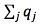

# Frequently Asked Questions

## General questions

### What is Expression Atlas

Expression Atlas is a resource to query gene and protein expression data across species and biological conditions and to visualise down-stream analysis results to explore co-expression. Queries can be either in a **baseline context**, e.g. [find genes expressed in the macaque brain](/gxa/search?organism=macaca%20mulatta&conditionQuery=%5B%7B%22value%22%3A%22brain%22%7D%5D), or in a **differential context**, e.g. [find genes that are up or downregulated in response to auxin in Arabidopsis](/gxa/search?geneQuery=%5B%5D&organism=Arabidopsis%20thaliana&conditionQuery=%5B%7B%22value%22%3A%22auxin%22%7D%5D&ds=%7B%22kingdom%22%3A%5B%22plants%22%5D%7D#differential). Expression Atlas contains thousands of selected microarray and RNA-sequencing data that are manually curated and annotated with ontology terms, checked for high quality and re-analysed using standardised methods.

### What experiments can be included in Expression Atlas?

To be included in Expression Atlas each experiment must meet all of the following criteria:

*   Experiment measures gene or protein expression
*   Raw data are available
*   All samples within the dataset belong to a single species
*   Samples come from non-bacterial species
*   The species genome is available through [Ensembl](http://www.ensembl.org/index.html)
*   Annotations for microarray probes are available
*   Sufficient sample annotation is provided

Additionally, we employ several “softer” guidelines to determine whether or not an experiment is eligible for inclusion into Expression Atlas:

*   (differential): The experiment should have at least 2 experimental groups, with 3 biological replicates each and also have a clear control/reference group
*   (baseline): The experiment design does not involve any perturbations and the dataset should have at least 3 experimental groups with 3 biological replicates each
*   The experiment addresses a relevant biological question (is not technical or proof of principle study)
*   Experimental metadata are of high quality and confidence
*   The experimental design is not too complex (e.g. not too many factors) and allows for straightforward one-to-one comparisons

If an experiment is judged to be of particular interest and its inclusion in Expression Atlas is highly valuable for the community, we may decide to include it even if it fails some of the above guidelines. We also actively collaborate with several specialized initiatives such as the [Gramene](http://www.gramene.org/) consortium and [OpenTargets](https://www.opentargets.org/) and prioritize experiments that are of special interest to our partners. Please do not hesitate to [contact our team](https://www.ebi.ac.uk/support/gxa) if you have any questions about how we select experiments for Expression Atlas or you wish to recommend a dataset(s) that you feel should be ingested and displayed in this resource.

### How can I obtain the original data for an experiment?

The original raw and processed data files for experiments in Expression Atlas can be found by viewing the experiment in [ArrayExpress](https://www.ebi.ac.uk/arrayexpress). On any **Experiment page**, e.g. [RNA-seq of 934 human cancer cell lines from the Cancer Cell Line Encyclopedia](/gxa/experiments/E-MTAB-2770) click on the  button in the **Resources** tab to view the experiment in ArrayExpress. The original submitted data files can be downloaded as zip archives, and sample annotation is available in MAGE-TAB format text files. See the online tutorial [ ArrayExpress: Discover functional genomics data quickly and easily](https://www.ebi.ac.uk/training/online/course/arrayexpress-discover-functional-genomics-data-qui/files-and-download) for further information.

### It doesn't look like the whole of the original experiment is in Expression Atlas, why not?

We sometimes only include part of an experiment in Expression Atlas because (1) there are not sufficient replicates of all the sample groups within an experiment, or (2) the hybridization or sequencing was not of high enough quality. If there are still enough assays in the experiment after the removal of those with too few replicates or low quality then we continue processing the experiment for Expression Atlas.

### How is microarray data quality controlled?

Microarray data quality is assessed using the [arrayQualityMetrics](https://www.bioconductor.org/packages/release/bioc/html/arrayQualityMetrics.html) package in [R](https://www.r-project.org/). Outlier arrays are detected using distance measures, boxplots, and MA plots. If an array is classed as an outlier by all three methods, it is excluded from further analysis. Please see the arrayQualityMetrics [documentation](https://www.bioconductor.org/packages/release/bioc/vignettes/arrayQualityMetrics/inst/doc/arrayQualityMetrics.pdf) for more details on the methods used.

### How is RNA-seq data quality controlled?

RNA-seq reads are discarded based on several criteria. First, reads with quality scores less than Q10 are removed. Second, the reads are mapped against a contamination reference genome (_E. coli_ for animal data, fungal and microbial non-redundant reference for plants). Any reads that map to the contamination reference are removed. Third, reads with "uncalled" characters (i.e. "N"s) are discarded. Lastly, for paired-end libraries, any reads whose mate was lost in the previous three steps are also discarded. Please see the [iRAP](https://nunofonseca.github.io/irap/) [documentation](http://biorxiv.org/content/early/2014/06/06/005991) for more details on the methods used.

### How is microarray data analysed?

Raw single-channel microarray intensities are normalized using [RMA](https://biostatistics.oxfordjournals.org/content/4/2/249.long) via the [oligo](https://doi.org/10.1093/biostatistics/4.2.249) package from [Bioconductor](https://www.bioconductor.org/) ( [Affymetrix](https://www.affymetrix.com/) data) or using quantile normalization via the [limma](https://www.bioconductor.org/packages/release/bioc/html/limma.html) package ([Agilent](https://www.genomics.agilent.com/) data). Two-channel [Agilent](https://www.genomics.agilent.com/) data is normalized using LOESS via the [limma](https://www.bioconductor.org/packages/release/bioc/html/limma.html) package. Pairwise comparisons are performed using a moderated _t_\-test for each gene using [limma](https://www.bioconductor.org/packages/release/bioc/html/limma.html).

### How is RNA-seq data analysed?

RNA-seq data is analysed using the [iRAP](https://nunofonseca.github.io/irap/) pipeline. Quality-filtered reads are aligned to the latest version of the reference genome from [Ensembl](https://www.ensembl.org/index.html) using [TopHat2](https://genomebiology.biomedcentral.com/articles/10.1186/gb-2013-14-4-r36). Raw counts (number of mapped reads summarized and aggregated over each gene) are generated using [htseq-count](http://htseq.readthedocs.io/). Then, FPKM (fragments per kilobase of exon model per million mapped reads) and TPM (transcripts per million) are calculated. Pairwise comparisons are performed using a conditioned test based on the negative binomial distribution, using [DESeq](https://www.bioconductor.org/packages/release/bioc/html/DESeq.html).

### What are FPKM and TPM?

FPKM (fragments per kilobase of exon model per million reads mapped) and TPM (transcripts per million) are the most common units reported to estimate gene expression based on RNA-seq data. Both units are calculated from the number of reads that mapped to each particular gene sequence and both units are calculated taking into account two important factors in RNA-seq:

1.  The number of reads from a gene depends on its length. One expects more reads to be produced from longer genes.
2.  The number of reads from a gene depends on the sequencing depth that is the total number of reads you sequenced. One expects more reads to be produced from the sample that has been sequenced to a greater depth.

FPKM (introduced by [Trapnell et al, 2010](http://www.nature.com/nbt/journal/v28/n5/full/nbt.1621.html)) are calculated with the following formula:

where _qi_ are raw counts (number of reads that mapped for each gene), _li_ is gene length and  is the total number of mapped reads. The interpretation of FPKM is that if you sequence your RNA sample again, you expect to see for gene _i_, _FPKMi_ reads divided by gene _i_ length over a thousand and divided by the total number of reads mapped over a million.

[Li and Dewey, 2011](https://bmcbioinformatics.biomedcentral.com/articles/10.1186/1471-2105-12-323) introduced the unit TPM and [Pachter, 2011](https://arxiv.org/abs/1104.3889) established the relationship between both units. It is possible to compute TPM from FPKM as follows:

### How do I see how an individual experiment was analysed?

On any **Experiment page**, e.g.[RNA-seq of coding RNA of eight barley tissues from different developmental stages](/gxa/experiments/E-MTAB-2809) you can see a breakdown of the analysis steps from raw data to the results you see in Expression Atlas by selecting the _Experiment design_ or _Supplemmentary information_ tab on the top of the experiment section.

### How can I contact you?

If you have any questions, problems or suggestions we would love to hear from you. You may reach us through [the EBI Support & feedback form.](https://www.ebi.ac.uk/support/gxa)

### How can I keep up with the latest Expression Atlas news?

If you would like to stay up-to-date with news about our latest releases and developments, please subscribe to the [Expression Atlas mailing list](https://listserver.ebi.ac.uk/mailman/listinfo/arrayexpress-atlas).

### Can I use Expression Atlas anatomograms on my website?

Yes! The anatomical diagrams (anatomograms) that you see alongside the baseline data are available from [GitHub](https://github.com/gxa/anatomogram/). The anatomograms are licenced under [Creative Commons Attribution (CC BY)](https://creativecommons.org/licenses/by/4.0/); if you’d like to use them, all we ask is that you attribute [Expression Atlas](/gxa) when you do.

##Searching

### How do I find out what genes are expressed in a particular condition (e.g. in my favourite tissue, cell line, developmental stage)?

Use the **Condition query** search box on the [home page](/gxa) to search for the condition you are interested in e.g. [kidney](/gxa/search?conditionQuery=%5B%7B%22value%22%3A%22kidney%22%7D%5D). Click on **Show anatomogram** in the top left corner if you want to see the corresponding anatomogram for each of the species displayed. Your query is expanded using the Experimental Factor Ontology [(EFO)](https://www.ebi.ac.uk/efo/), so that this search will also returns matching synonyms and child terms of [kidney](https://www.ebi.ac.uk/ols/search?q=kidney&submit1=1&ontology=efo) in EFO. You will see both baseline expression and differential expression results in the condition (organism part in our example) you searched for.

Select one experiment from the Baseline multi-experiment page (e.g. [GTEx](/gxa/experiments/E-MTAB-5214)) to see the results in that particular experiment. Use the _Select_ button under **Organism parts** on the left sidebar to find [what genes are expressed in kidney in GTEx](/gxa/experiments/E-MTAB-5214/Results?specific=true&geneQuery=%255B%255D&filterFactors=%257B%2522ORGANISM_PART%2522%253A%255B%2522cortex%2520of%2520kidney%2522%255D%257D&cutoff=%257B%2522value%2522%253A0.5%257D&unit=%2522TPM%2522).

### How do I search for multiple conditions at once?

Use the **Condition query** search box on the [home page](/gxa) to search for as many conditions as you want. You will need to type each condition, click enter and when you are done, just search. For example, searching with  will find [ all experiments in which both liver and heart are studied as well as the ones analysing either liver or heart](/gxa/search?conditionQuery=%5B%7B%22value%22%3A%22liver%22%7D%2C%7B%22value%22%3A%22heart%22%7D%5D).

### How do I find out in which conditions my favourite gene is expressed?

Use the **Gene query** search box on the [home page](/gxa) to search for your favourite gene (e.g. [SFTPC](/gxa/search?geneQuery=%5B%7B%22value%22%3A%22SFTPC%22%2C%22category%22%3A%22symbol%22%7D%5D)). Click on **Show anatomogram** in the top left corner if you want to see the corresponding anatomogram for each of the species displayed. You will see **Baseline expression** results in different conditions (e.g. organism part, cell line, cell type, developmental stage) and **Differential expression** results for biologically meaningful pairwise comparisons.

Select one experiment from the **Baseline expression** results (e.g. [GTEx](/gxa/experiments/E-MTAB-5214)) to see the results in that particular experiment. Use the **Gene query** box (e.g. SFTPC in our example) to find [in which tissues from GTEx gene SFTPC is expressed](/gxa/experiments/E-MTAB-5214/Results?specific=true&geneQuery=%255B%257B%2522value%2522%253A%2522SFTPC%2522%252C%2522category%2522%253A%2522symbol%2522%257D%255D&filterFactors=%257B%257D&cutoff=%257B%2522value%2522%253A0.5%257D&unit=%2522TPM%2522).

### How do I search for multiple genes at once?

Use the **Gene query** search box on the [home page](/gxa) to search for as many genes as you want. You will need to type each gene, click enter and when you are done, just search.

### What gene identifiers can I use to search?

You may use the following identifiers to search using the **Gene query** box:

*   Gene name symbol, e.g. [SFTPC](/gxa/search?geneQuery=[{"value":"SFTPC"}])
*   [Ensembl](https://www.ensembl.org/index.html) gene ID, e.g. [ENSG00000168484](/gxa/genes/ENSG00000168484)
*   [UniProt](https://www.uniprot.org/) ID, e.g. [O14777](/gxa/genesets/O14777)
*   [Interpro](https://www.ebi.ac.uk/interpro/) ID, e.g. [IPR001729](/gxa/genesets/IPR001729)
*   [Gene Ontology](http://www.geneontology.org/) ID, e.g. [GO:0007585](/gxa/genesets/GO:0007585)
*   [Gene Ontology](http://www.geneontology.org/) term, e.g. [respiratory gaseous exchange](/gxa/search?geneQuery=[{"value":"respiratory gaseous exchange"}])

### How do I find a particular experiment?

You can easily see all experiments in Expression Atlas by clicking in **All experiments** on the [home page](/gxa). You can narrow down the list of experiments by selecting Baseline or Differential in the first column at the bottom of the table. You can also select Plants or Animal and Fungi experiments (using the second column), experiments from a particular organism (fifth column) or experiments involving a particular variable (sixth column). Click on the Experiment title to see the experiment in Expression Atlas.

If you know the [ArrayExpress](https://www.ebi.ac.uk/arrayexpress) accession of the experiment you want to see (e.g. [E-MTAB-4202](https://www.ebi.ac.uk/arrayexpress/experiments/E-MTAB-4202/) ), you can link to the experiment in Expression Atlas using the following format: `https://www.ebi.ac.uk/gxa/experiments/**<ArrayExpress accession>**`

e.g. [https://www.ebi.ac.uk/gxa/experiments/E-MTAB-4202](/gxa/experiments/E-MTAB-4202)

### Are there any alternative ways of searching in Atlas?

It's best if you contact us and we will be able to advise you on your specific use case.

In the meantime, you can construct queries using URLs like the ones in the table below. Please be aware that the format of these URLs is subject to change. If your queries stop working, please check back here for the latest standard or get in touch with us through [the EBI Support & feedback form.](https://www.ebi.ac.uk/support/gxa)

Query

URL

In what conditions is [ASPM](/gxa/genes/ENSG00000066279) differentially expressed?

https://www.ebi.ac.uk/gxa/search?geneQuery=\[{"value":"ASPM"}\]#differential

What genes are differentially expressed in cancer?

https://www.ebi.ac.uk/gxa/search?conditionQuery=\[{"value":"cancer"}\]#differential

Show me comparisons where [zinc finger](https://www.ebi.ac.uk/interpro/entry/IPR007087) genes are differentially expressed in mice.

https://www.ebi.ac.uk/gxa/search?geneQuery=\[{"value":"zinc finger"}\]&organism=Mus musculus#differential

##Results

### When I search in Expression Atlas, what do the Baseline Expression results show?

If you search for a particular gene (e.g. **CFHR2**), the **Baseline Expression** results will display all organisms and conditions in which CFHR2 is expressed above the default minimum expression level of 0.5 FPKM or 0.5 TPM.

By default, we display expression data for different tissues, e.g [in which tissues is CFHR2 expressed?](/gxa/search?geneQuery=[{"value":"CFHR2", "category":"symbol"}]) but you can also use the filters to find gene expression in other conditions, such as [in which mouse cell types is CFHR2 expressed?](/gxa/genes/ENSMUSG00000033898?bs=%7B%22mus%20musculus%22%3A%5B%22CELL_TYPE%22%5D%7D&ds=%7B%22kingdom%22%3A%5B%22animals%22%5D%7D#baseline)

If you search for a particular condition (e. g. [liver](/gxa/search?conditionQuery=[{"value":"liver"}]#baseline)), in the **Baseline Expression** results you will see all organisms and experiments matching your search.

### In Baseline expression results, how are baseline expression levels represented?

In **Baseline expression** results you will see one heatmap per species. Each heatmap shows, for each species, all conditions (columns) and all experiments (rows) that matched your search. Expression levels are displayed in the heatmap in five different colours:

1.  Grey box: expression level is below cutoff (0.5 FPKM or 0.5 TPM)
2.  Light blue box: expression level is low (between 0.5 to 10 FPKM or 0.5 to 10 TPM)
3.  Medium blue box: expression level is medium (between 11 to 1000 FPKM or 11 to 1000 TPM)
4.  Dark blue box: expression level is high (more than 1000 FPKM or more than 1000 TPM)
5.  White box: there is no data available

### How can I see the results for each experiment in Baseline expression results?

Each Baseline expression experiment in Expression Atlas has its own **Experiment page**, e.g. [Strand-specific RNA-seq of 13 human tissues from Michael Snyder's lab for the ENCODE project](/gxa/experiments/E-MTAB-4344) where you can see a heatmap showing the 50 most specifically expressed genes across all conditions studied.

You can further refine the query by narrowing the search to a particular gene (e.g. [CTRB1](/gxa/experiments/E-MTAB-4344/Results?specific=true&geneQuery=%255B%257B%2522value%2522%253A%2522Ctrb1%2522%252C%2522category%2522%253A%2522symbol%2522%257D%255D&filterFactors=%257B%257D&cutoff=%257B%2522value%2522%253A0.5%257D&unit=%2522TPM%2522)), or gene sets (e.g. [CELA3A, CELA3B, CTRB1, CTRB2, PRSS1, PRSS2](/gxa/experiments/E-MTAB-4344/Results?specific=true&geneQuery=%255B%257B%2522value%2522%253A%2522CELA3A%2522%252C%2522category%2522%253A%2522symbol%2522%257D%252C%257B%2522value%2522%253A%2522CELA3B%2522%252C%2522category%2522%253A%2522symbol%2522%257D%252C%257B%2522value%2522%253A%2522CTRB1%2522%252C%2522category%2522%253A%2522symbol%2522%257D%252C%257B%2522value%2522%253A%2522CTRB2%2522%252C%2522category%2522%253A%2522symbol%2522%257D%252C%257B%2522value%2522%253A%2522PRSS1%2522%252C%2522category%2522%253A%2522symbol%2522%257D%252C%257B%2522value%2522%253A%2522PRSS2%2522%252C%2522category%2522%253A%2522symbol%2522%257D%255D&filterFactors=%257B%257D&cutoff=%257B%2522value%2522%253A0.5%257D&unit=%2522TPM%2522)), or by limiting which organism parts are searched over (e.g. [genes specifically expressed in pancreas](/gxa/experiments/E-MTAB-4344/Results?specific=true&geneQuery=%255B%255D&filterFactors=%257B%2522ORGANISM_PART%2522%253A%255B%2522pancreas%2522%255D%257D&cutoff=%257B%2522value%2522%253A0.5%257D&unit=%2522TPM%2522)).

### In the experiment page, how are baseline expression levels represented?

In the Experiment page, e.g. [Transcription profiling by high throughput sequencing of different potato tissues (genotype RH89-039-16)](/gxa/experiments/E-MTAB-552)expression levels are represented in one heatmap that shows gene expression levels for the 50 most specifically expressed genes (rows) across all conditions studied in the experiment selected (columns).

Expression levels are displayed in the heatmap by colour intensity, according to the gradient bar above the heatmap. Hover the mouse above a cell to show a tooltip with the numerical values corresponding to each colour.

### Can I download the baseline expression results?

Yes, click on the  button above the heatmap to download the data corresponding to your query. For example, if you select 'flower' in the **Organism part** box, use the **Download all results** button to download expression data for the [ subset of genes specifically expressed in flower](/gxa/experiments/E-MTAB-552/Results?specific=true&geneQuery=%255B%255D&filterFactors=%257B%2522ORGANISM_PART%2522%253A%255B%2522flower%2522%252C%2522stamen%2522%255D%257D&cutoff=%257B%2522value%2522%253A0.5%257D&unit=%2522TPM%2522) in tab-delimited format with no ordering.

On the other hand, by clicking on the _Downloads tab_ of the experiment page you will download expression data for all genes and all conditions studied in the experiment.

### Can I view the results in the Ensembl browser?

Yes, you can. From the heatmap of the Experiment page, e.g. [Baseline expression from transcriptional profiling of zebrafish developmental stages](/gxa/experiments/E-ERAD-475) just select a gene (e.g. **SNORD61**) and a condition, developmental stage in that particular experiment (e.g. **gastrula 50%-epiboly**) and click on the  button in the left of the heatmap. You will see [ gene expression value for gene SNORD61 in developmental stage gastrula 50%-epiboly in the context of the genomic location of SNORD61](https://www.ensembl.org/Danio_rerio/Location/View?g=ENSDARG00000083171;r=14:31520436-31520513;t=ENSDART00000116362;text=;time=1504707519).

For plant experiments, e.g. [Transcriptomes for hybrids (F1s) between 18 Arabidopsis thaliana parents of the Multiparent Advanced Generation Inter-Cross (MAGIC) genetic mapping resource](/gxa/experiments/E-GEOD-55482) you can also use the  button to see, for example, [ gene expression value for gene EPR1 in ecotype Sf-2 x Can-0 in the context of the genomic location of EPR1](http://ensembl.gramene.org/Arabidopsis_thaliana/Location/View?g=AT2G27380;r=2:11713411-11715774;t=AT2G27380.1;time=1484746364).

For experiments performed in _Caenorhabditis elegans_ or in _Schistosoma mansoni_ such as [RNA-Seq of Schistosoma mansoni (flatworms) larva and adult individuals at different life-stages](/gxa/experiments/E-MTAB-451) you can see the results using the  button.

### How are similarly expressed genes computed?

Similarly expressed genes across conditions in baseline experiments (e.g. tissues, developmental stages) are shown where available. They are computed on per-experiment basis, for experiments with three or more conditions. The method for estimating them involves two steps. The first one involves k-means clustering (for all possible values of k, capped to 100) of the expression of each gene across (e.g.) tissues. The second step compares the clusters on a gene-to-gene basis and outputs a ranked list of genes with decreasing similarity of expression patterns for each gene. The top 50 similarly expressed genes can be explored on our interface. Lowly expressed genes are filtered out from the calculation. The method has been implemented within the Bioconductor package [ClusterSeq](https://bioconductor.org/packages/devel/bioc/html/clusterSeq.html).

### When I search in Expression Atlas, what do the Differential Expression results show?

If you search for a particular gene (e.g. **CFHR2**), in the **Differential expression** results you will see [all comparisons in all species in which CFHR2 is differentially expressed](/gxa/search?geneQuery=[{"value":"CFHR2"}]#differential) (absolute value of log2 fold-change > 1 and adjusted p-value < 0.05). Comparisons in which gene CFHR2 is differentially expressed are ordered so the one with the largest absolute value of log2 fold-change is at the top. If gene CFHR2 has identical log2 fold-change in several comparisons, then the one with the lower adjusted _p_\-value goes first.

If you search for a particular condition (e. g. **liver**), in the **Differential expression** results you will see [all comparisons in all species that matched your search](/gxa/search?conditionQuery=[{"value":"liver"}]#differential). When several genes show differential expression you will see one row per each gene and comparison. Comparisons are ordered following the same criteria as explained before.

In both cases, you can narrow down the results displayed using the filters in the left where you can select a particular species (e.g. Mus musculus), experimental variable (e.g. compound) to see which comparisons involve the treatment of liver with a compound in mouse.

Click on the Comparison name (e.g. ['CCl4; 1.6 gram per kilogram' at '24 hour' vs 'none' at '0 hour'](/gxa/experiments/E-MTAB-2445?geneQuery=ENSMUSG00000026839&queryFactorValues=g1_g5&specific=false)) to find out more information about a particular gene-comparison combination. In microarray experiments, some genes may be targeted by more than one probe set. The table in the **Differential expression** results shows the values for the probe set with the largest absolute log2 fold-change. You can see details of all probe sets for a given gene on the Experiment page. For example, [gene Car3 is represented by 4 probe sets](/gxa/experiments/E-MTAB-2445/Results?specific=true&geneQuery=%255B%257B%2522value%2522%253A%2522Car3%2522%252C%2522category%2522%253A%2522symbol%2522%257D%255D&filterFactors=%257B%257D&cutoff=%257B%2522foldChange%2522%253A1%252C%2522pValue%2522%253A0.05%257D&regulation=%2522UP_DOWN%2522) in the experiment [Transcriptional responses in liver upon acute CCl4 intoxication](/gxa/experiments/E-MTAB-2445).

### What is a "design element"?

On microarray experiment pages, you will see the **design element** name alongside the gene name. A design element is also known as a probe or probe set. This is the oligonucleotide probe (or group thereof) on the microarray that targets that gene.

### What is a "comparison"?

A **comparison** is where two groups of samples are compared in a differential expression experiment. An example of a comparison is ['breast cancer' _vs._ 'normal'](/gxa/experiments/E-GEOD-31138/Results).

For each gene, the mean expression level of the **test** group (e.g. breast cancer) is compared with the mean expression level of the **reference** group (e.normal), and a statistical test is performed to decide whether the two means are significantly different.

### What do the red and blue colours mean in the Differential expression results?

Let's search for the condition [breast cancer in a differential context](/gxa/search?conditionQuery=%5B%7B%22value%22%3A%22breast%20cancer%22%7D%5D#differential). A red box indicates that the gene is **up-regulated** in the test condition while a blue box means that the gene is **down-regulated** in the test condition. The colour intensity of filled boxes in the table represents how large the log2 fold-change is for each gene. The larger the log2 fold-change, the more intense the red or blue colour.

The two bars above the Differential expression results table show the red and blue colour intensities for the **top 50** genes shown on the page. The colour intensities represent the log2 fold-changes for the genes shown.

### How do I see the actual log2 fold-changes in the Differential expression results table?

Click on the  button to the top left corner of the table to see the numerical values of the log2 fold-change per each gene in each comparison.

### Where do the _p_\-values come from?

In a microarray experiment, each gene's mean expression level in the **test** group is compared with its mean expression level in the **reference** group using a moderated _t_\-test. This is done using the [limma](https://www.bioconductor.org/packages/2.13/bioc/html/limma.html) package from [Bioconductor](https://www.bioconductor.org/).

In an RNA-seq experiment, each gene's mean expression level in the **test** group is compared with its mean expression level in the **reference** group using a conditioned test based on the negative binomial distribution, analogous to Fisher's exact test. This is done using the [DESeq](https://www.bioconductor.org/packages/2.13/bioc/html/DESeq.html) package in [Bioconductor](https://www.bioconductor.org/).

Because the same test is done on thousands of genes at once, _p_\-values are adjusted for **multiple testing** using the [Benjamini and Hochberg (1995)](https://www.jstor.org/stable/2346101) false discovery rate (FDR) correction. This is what is meant by **adjusted _p_\-value**.

### How are the gene set enrichment plots created?

Gene set enrichment analysis is performed using the [Piano](https://www.bioconductor.org/packages/release/bioc/html/piano.html) package from [Bioconductor](https://www.bioconductor.org/). For each comparison, enrichment of terms from [GO](http://www.geneontology.org/), [InterPro](https://www.ebi.ac.uk/interpro/), and [Reactome](http://www.reactome.org/) is tested for within the set of differentially expressed genes, using a variation on [Fisher's exact test](https://en.wikipedia.org/wiki/Fisher%27s_exact_test). Gene set enrichment plots are only shown when statistically significant enrichment of terms was detected. This means that for some experiments, the menu will not display plots for all three of the aforementioned resources.

### Can I download the differential expression results?

Yes, click on the  button above the heatmap to download the data corresponding to your query. For example, in [Transcription profiling by array of pancreatic islets from Sgpp2 knockout mice after high fat diet](/gxa/experiments/E-GEOD-73131) if you select just one comparison, e.g. 'high fat diet' vs 'normal' in 'Sgpp2 knockout' from the **Comparison** box and click Apply, by clicking on the **Download all results** button you will download [ expression data for the subset of genes differentially expressed in that particular comparison](/gxa/experiments/E-GEOD-73131/Results?specific=true&geneQuery=%255B%255D&filterFactors=%257B%2522COMPARISON_NAME%2522%253A%255B%2522%27high%2520fat%2520diet%27%2520vs%2520%27normal%27%2520in%2520%27Sgpp2%2520knockout%27%2522%255D%257D&cutoff=%257B%2522foldChange%2522%253A1%252C%2522pValue%2522%253A0.05%257D&regulation=%2522UP_DOWN%2522) in tab-delimited format with no ordering.

On the other hand, by clicking on the _Downloads_ tab of the experiment page you will download expression data for all genes in all comparisons studied in the experiment.
  

  

#### Jump to...

##### [General](#general-questions)

*   [What is Expression Atlas](#what-is-expression-atlas)
*   [How are experiments chosen to be in Expression Atlas?](#what-experiments-can-be-included-in-expression-atlas)
*   [How can I obtain the original data for an experiment?](#how-can-i-obtain-the-original-data-for-an-experiment)
*   [It doesn't look like the whole of the original experiment is in Expression Atlas, why not?](#it-doesnt-look-like-the-whole-of-the-original-experiment-is-in-expression-atlas-why-not)
*   [How is microarray data quality controlled?](#how-is-microarray-data-quality-controlled)
*   [How is RNA-seq data quality controlled?](#how-is-RNA-seq-data-quality-controlled)
*   [How is microarray data analysed?](#how-is-microarray-data-analysed)
*   [How is RNA-seq data analysed?](#how-is-rna-seq-data-analysed)
*   [What are FPKM and TPM?](#what-are-fpkm-and-tpm)
*   [How do I see how an individual experiment was analysed?](#how-do-i-see-how-an-individual-experiment-was-analysed)
*   [How can I contact you?](#how-can-i-contact-you)
*   [How can I keep up with the latest Expression Atlas news?](#how-can-i-keep-up-with-the-latest-expression-atlas-news)
*   [Can I use Expression Atlas anatomograms on my website?](#can-i-use-expression-atlas-anatomograms-on-my-website)

##### [Searching](#searching)

*   [How do I find out what genes are expressed in a particular condition (e.g. in my favourite tissue, cell line, developmental stage)?](#how-do-I-find-out-what-genes-are-expressed-in-a-particular-condition-e-g-in-my-favourite-tissue-cell-line-developmental-stage)
*   [How do I search for multiple conditions at once?](#how-do-i-search-for-multiple-conditions-at-once)
*   [How do I find out in which conditions my favourite gene is expressed?](#how-do-i-find-out-in-which-conditions-my-favourite-gene-is-expressed)
*   [How do I search for multiple genes at once?](#how-do-i-search-for-multiple-genes-at-once)
*   [What gene identifiers can I use to search?](#what-gene-identifiers-can-i-use-to-search)
*   [How do I find a particular experiment?](#how-do-i-find-a-particular-experiment)
*   [Can I search Expression Atlas programmatically?](#are-there-any-alternative-ways-of-searching-in-atlas)

##### [Results](#results)

*   [When I search in Expression Atlas, what do the Baseline Expression results show?](#when-i-search-in-expression-atlas-what-do-the-baseline-expression-results-show)
*   [In Baseline expression results, how are baseline expression levels represented?](#in-baseline-expression-results-how-are-baseline-expression-levels-represented)
*   [How can I see the results for each experiment in Baseline expression results?](#how-can-i-see-the-results-for-each-experiment-in-baseline-expression-results)
*   [In the experiment page, how are baseline expression levels represented?](#in-the-experiment-page-how-are-baseline-expression-levels-represented)
*   [Can I download the baseline expression results?](#can-i-download-the-baseline-expression-results)
*   [Can I view the results in the Ensembl browser?](#can-i-view-the-results-in-the-ensembl-browser)
*   [How are similarly expressed genes computed?](#how-are-similarly-expressed-genes-computed)
*   [When I search in Expression Atlas, what do the Differential Expression results show?](#when-i-search-in-expression-atlas-what-do-the-differential-expression-results-show)
*   [What is a "design element"?](#what-is-a-design-element)
*   [What is a "comparison"?](#what-is-a-comparison)
*   [What do the red and blue colours mean in the Differential expression results?](#what-do-the-red-and-blue-colours-mean-in-the-differential-expression-results)
*   [How do I see the actual log2 fold-changes in the Differential expression results table?](#how-do-i-see-the-actual-log2-fold-changes-in-the-differential-expression-results-table)
*   [Where do the _p_\-values come from?](#where-do-the-p-values-come-from)
*   [How are the gene set enrichment plots created?](#how-are-the-gene-set-enrichment-plots-created)
*   [Can I download the differential expression results?](#can-i-download-the-differential-expression-results)

